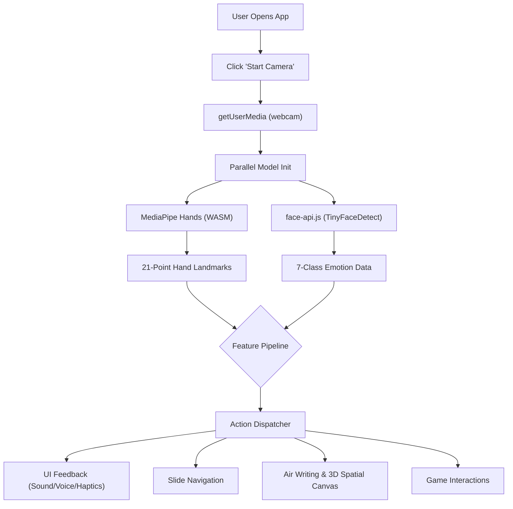

<div align="center">

# ✨ ArcMotion ✨

**Next-Generation Spatial Computing in Your Browser**

[](https://reactjs.org/)
[](https://www.typescriptlang.org/)
[](https://vitejs.dev/)
[](https://threejs.org/)
[](https://mediapipe.dev/)

A real-time gesture and voice control web application. Control presentations, draw in the air, play gesture-based games, create custom gestures, and explore 3D space — all entirely through your webcam.

🔗 **[Launch Live Demo](https://hand-gestures-lovat.vercel.app)** • 📖 **[Report Bug](https://github.com/Aniket886/hand-gestures/issues)** • 💡 **[Request Feature](https://github.com/Aniket886/hand-gestures/issues)**

</div>

---

## 🌟 Hero Features

ArcMotion goes beyond basic hand tracking, offering a fully multimodal, installable experience right in your browser.

> 🎙️ **Arc Voice Assistant**
> A persistent, app-level voice assistant powered by Groq. Say `"Arc"` to wake the assistant, then speak commands like `"start tracking"` or `"next slide"`. Ask it questions, and it will intelligently pause its own listening while it answers you.

> 🌌 **Spatial Interaction Mode (`/spatial`)**
> Step into the third dimension. Draw 3D interactive lines in the air, grab and scale objects with two-handed pinches, or explore an interactive Solar System scene where you control the cosmos with your fingertips.

> 📱 **PWA & Offline-First**
> Install ArcMotion on your device. Once online caching warms up the AI models (`@mediapipe/hands` & `@vladmandic/face-api`), the entire app works seamlessly offline.

---

## 📸 Capabilities Overview

| Feature | Description |
| :--- | :--- |
| 🖐️ **Advanced Hand Tracking** | Real-time multi-hand landmark detection (21 points per hand). |
| 🎭 **Emotion & Engagement** | Real-time facial emotion recognition combined with gesture metrics to calculate live engagement scores. |
| ✍️ **Air Writing & Erasing** | Draw in the air with your index finger; erase instantly by showing an open palm. |
| 📏 **Spatial Geometry** | Visualize "finger strings" between hands and measure physical distance in centimeters. |
| 📊 **Presentation Mode** | Effortlessly control slide decks with physical swipe gestures. |
| 🎮 **Gesture Gaming** | Play built-in mini-games: *Bubble Pop*, *Catch Star*, and *Gesture Match*. |
| ⚙️ **Custom Mappings** | Easily remap the 18+ supported gestures to trigger custom actions. |
| 🔊 **Multimodal Feedback** | Contextual sound, haptic, and voice feedback on successful gesture recognition. |

---

## 🎮 The Gesture Library

A quick reference guide for interacting with ArcMotion's default mappings.

| Gesture | Pose / Emoji | Default Action | Spatial Mode Action |
| :--- | :---: | :--- | :--- |
| **Open Palm** | 🖐️ | Erase drawing | - |
| **Pinch** | 🤏 | Zoom | Grab / Release |
| **Pinch + Drag** | 🤏 ↔️ | - | Move Object |
| **2-Hand Pinch** | 🤏 🤏 | - | Scale Object |
| **Fist** | ✊ | Pause | - |
| **Pointing** | 👆 | Select | - |
| **Thumbs Up/Down**| 👍 👎 | Approve / Dislike | - |
| **Peace** | ✌️ | Next | - |
| **Swipe L/R** | 👈 👉 | Next / Prev Slide | - |

---

## 🛠 Tech Stack

ArcMotion is built with modern, type-safe, and highly optimized web technologies.

| Category | Technologies |
| :--- | :--- |
| **Frontend Core** | React 18, TypeScript 5, Vite 5, React Router 6 |
| **Styling & UI** | Tailwind CSS 3, Framer Motion, shadcn/ui, Radix UI, Lucide React, Recharts |
| **AI & Vision** | MediaPipe Hands (WASM), face-api.js (TinyFaceDetect) |
| **3D Rendering** | Three.js, React Three Fiber (R3F) |
| **State & Data** | TanStack React Query, React Hook Form, Zod |

---

## 🚀 Getting Started

Follow these steps to run ArcMotion locally. 

### Prerequisites
* Node.js 18+ or Bun
* A functioning webcam
* A modern browser (Chrome, Edge, or Firefox)

### Installation

**1. Clone the repository**
```bash
git clone [https://github.com/Aniket886/hand-gestures.git](https://github.com/Aniket886/hand-gestures.git)
cd hand-gestures
```

**2. Install dependencies**
```bash
npm install
```

**3. Start the development server**
```bash
npm run dev
```
*Visit `http://localhost:8080` to see the app in action.*

**4. Build for Production**
```bash
npm run build
npm run preview
```

---

## 🧠 Application Architecture

ArcMotion uses a highly parallelized pipeline to process video feeds without blocking the main UI thread.



---

## 🐛 Troubleshooting & FAQs

<details>
<summary><strong>1. "k8.Hands is not a constructor" in Production</strong></summary>
<br>
<strong>Issue:</strong> The app crashes on the published site due to `@mediapipe/hands` not exporting a standard ESM module.
<br>
<strong>Fix:</strong> Implemented a dynamic runtime loader that safely attaches to `globalThis`, bypassing Rollup's tree-shaking limitations in Vite.
</details>

<details>
<summary><strong>2. Camera opens, but hand tracking shows 0 FPS</strong></summary>
<br>
<strong>Issue:</strong> The `requestAnimationFrame` loop was sending frames before the WASM model fully initialized, causing dropped frames.
<br>
<strong>Fix:</strong> Enforced an `await hands.initialize()` block with a 15-second timeout wrapper before the loop begins.
</details>

<details>
<summary><strong>3. MediaPipe fails on older devices</strong></summary>
<br>
<strong>Issue:</strong> Devices lacking WebGL2 support crashed during GPU initialization.
<br>
<strong>Fix:</strong> Built an automatic GPU → CPU fallback chain. If WebGL fails, the app re-initializes using the CPU backend.
</details>

<details>
<summary><strong>4. Camera won't open on the live URL</strong></summary>
<br>
<strong>Issue:</strong> `navigator.mediaDevices` is undefined.
<br>
<strong>Fix:</strong> The browser restricts webcam access to secure contexts. Ensure you are using `https://` or `localhost`.
</details>

<details>
<summary><strong>5. Text measurements are rendering mirrored</strong></summary>
<br>
<strong>Issue:</strong> Canvas text inherits the CSS `scaleX(-1)` used to mirror the video feed.
<br>
<strong>Fix:</strong> Applied a context transformation (`ctx.scale(-1, 1)`) right before `fillText()` to counter the CSS mirroring.
</details>

---

## 📂 Project Structure

<details>
<summary>Click to expand folder architecture</summary>

```text
src/
├── pages/             # Route components (Index, Presentation, PlayCanvas, NotFound)
├── hooks/             # Core logic (useHandTracking, useFaceEmotion, useEngagement)
├── components/        # UI pieces (HUDs, Modals, Legends, Toggles)
│   └── games/         # Built-in mini-games
├── lib/               # Utility functions, gesture classification, feedback logic
└── main.tsx           # Application entry point
```
</details>

---

## 📄 License & Credits

Distributed under the MIT License. See `LICENSE` for more information.

<div align="center">
  <strong>Architected & Developed by <a href="https://github.com/Aniket886">Aniket Tegginamath</a></strong>
</div>
