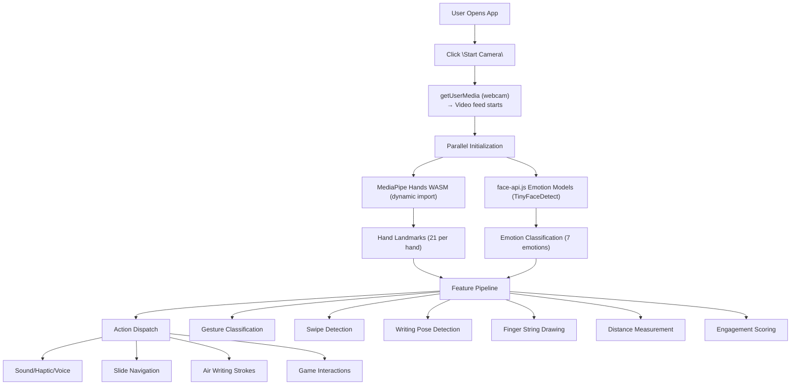

# ArcMotion

A real-time gesture + voice control web application built with **React**, **MediaPipe**, **face-api.js**, and an "Arc" voice assistant. Control presentations, draw in the air, play gesture-based games, create custom gestures, and more — all through your webcam.

🔗 **Live Demo**: [hand-gestures.app](https://hand-gestures-lovat.vercel.app)

## Contents

- [Features](#features)
- [Tech Stack](#tech-stack)
- [Project Structure](#project-structure)
- [Application Flow](#application-flow)
- [Issues Encountered & Solutions](#issues-encountered--solutions)
- [Getting Started](#getting-started)
- [Supported Gestures](#supported-gestures)
- [License](#license)
- [Arc Voice Flow](#arc-voice-flow)

---

<a id="arc-voice-flow"></a>
## Arc Voice Flow

Arc is a persistent app-level voice assistant:

- Turn Arc on once and it should stay enabled across navigation until you turn it off.
- Say `Arc` to arm it for a short wake window, then speak a command like `start tracking` or `next slide`.
- If the armed phrase is question-like (`what`, `how`, `tell me`, `explain`, etc.), Arc sends it to the Groq-backed `/api/arc` endpoint and speaks the answer.
- Arc pauses speech recognition while it speaks so it does not re-trigger on its own reply, then resumes listening after the response ends.

If debugging stale or glitchy voice behavior, check the Arc status panel in Tools and the browser console first.

---

<a id="features"></a>
## 📸 Features

| Feature                           | Description                                                               |
| --------------------------------- | ------------------------------------------------------------------------- |
| **Hand Tracking**                 | Real-time multi-hand landmark detection (21 points per hand)              |
| **18+ Gesture Recognition**       | Open palm, fist, peace, thumbs up/down, pinch, vulcan, rock, and more     |
| **Air Writing**                   | Draw in the air using your index finger (writing pose)                    |
| **Open Palm Eraser**              | Erase air-writing strokes by showing an open palm                         |
| **Finger Strings**                | Visual strings connecting raised fingertips across hands                  |
| **Distance Measurement**          | Measure distance between fingertips in centimeters (toggleable)           |
| **Emotion Detection**             | Real-time facial emotion recognition (happy, sad, angry, surprised, etc.) |
| **Engagement Score**              | Combined metric from gestures + facial expressions                        |
| **Presentation Mode**             | Control slides with swipe gestures                                        |
| **Mini Games**                    | Bubble Pop, Catch Star, Gesture Match — all gesture-controlled            |
| **Haptic/Sound/Voice Feedback**   | Multi-modal feedback on gesture recognition                               |
| **Customizable Gesture Mappings** | Remap gestures to different actions                                       |
| **Spatial Interaction Mode**      | Draw shapes into space, grab 3D objects, and explore a Solar System demo  |

---

<a id="tech-stack"></a>
## 🛠 Tech Stack

### Frontend

| Technology         | Purpose                  |
| ------------------ | ------------------------ |
| **React 18**       | UI framework             |
| **TypeScript 5**   | Type safety              |
| **Vite 5**         | Build tool & dev server  |
| **Tailwind CSS 3** | Utility-first styling    |
| **Framer Motion**  | Animations & transitions |
| **React Router 6** | Client-side routing      |
| **Three.js + R3F** | Spatial 3D scene rendering |

### AI / ML Libraries

| Library             | Purpose                                          |
| ------------------- | ------------------------------------------------ |
| **MediaPipe Hands** | Hand landmark detection (21 keypoints × 2 hands) |
| **face-api.js**     | Facial emotion recognition                       |

### UI Components

| Library          | Purpose                                               |
| ---------------- | ----------------------------------------------------- |
| **shadcn/ui**    | Accessible component primitives                       |
| **Radix UI**     | Headless UI primitives (dialog, tabs, tooltips, etc.) |
| **Lucide React** | Icon library                                          |
| **Recharts**     | Engagement score charts                               |

### State & Data

| Library                   | Purpose                    |
| ------------------------- | -------------------------- |
| **TanStack React Query**  | Async state management     |
| **React Hook Form + Zod** | Form handling & validation |

## Spatial Interaction Mode

ArcMotion now includes a dedicated `/spatial` route with three immersive modes:

- `Draw Mode`: use hand-tracked air-writing, then commit sketches into 3D interactive line objects.
- `Spatial Interaction Mode`: grab, move, rotate, and scale created objects using pinch-driven hand input.
- `Solar System Mode`: explore a 3D Solar System scene where planets can be selected, moved, inspected, and reset.

Current gesture mapping for this mode:
- single-hand pinch: grab / release
- pinch + drag: move object
- two-hand pinch: scale object
- orbit camera controls: inspect scene in 360 degrees

---

<a id="project-structure"></a>
## 📁 Project Structure

<details>
<summary>Source tree</summary>

```
src/
├── pages/
│   ├── Index.tsx          # Main camera + gesture dashboard
│   ├── Presentation.tsx   # Slide presentation mode
│   ├── PlayCanvas.tsx     # Gesture-controlled games
│   └── NotFound.tsx       # 404 page
├── hooks/
│   ├── useHandTracking.ts # Core hand tracking logic (MediaPipe)
│   ├── useFaceEmotion.ts  # Facial emotion detection (face-api.js)
│   ├── useEngagementScore.ts # Combined engagement metric
│   └── useGestureMappings.ts # Customizable gesture-to-action map
├── components/
│   ├── GestureHUD.tsx     # Gesture info overlay
│   ├── EmotionHUD.tsx     # Emotion info overlay
│   ├── AirWritingCanvas.tsx # Air drawing canvas
│   ├── FeatureToggles.tsx # Toggle panel for features
│   ├── GestureLegend.tsx  # Gesture reference guide
│   ├── EngagementPanel.tsx # Engagement score display
│   ├── GestureSettingsModal.tsx # Gesture mapping editor
│   ├── DemoPresentation.tsx # Demo slide deck
│   ├── FeedbackControls.tsx # Sound/haptic/voice toggles
│   └── games/
│       ├── BubblePop.tsx  # Pop bubbles with gestures
│       ├── CatchStar.tsx  # Catch falling stars
│       └── GestureMatch.tsx # Match gesture prompts
├── lib/
│   ├── gestures.ts        # Gesture classification algorithms
│   ├── feedback.ts        # Audio/haptic/voice feedback
│   └── utils.ts           # Utility functions
└── main.tsx               # App entry point
```

</details>

---

<a id="application-flow"></a>
## 🔄 Application Flow



<details>
<summary>ASCII flow (original)</summary>

```text
┌─────────────────────────────────────────────────┐
│                   User Opens App                 │
└──────────────────────┬──────────────────────────┘
                       ▼
              ┌─────────────────┐
              │  Click "Start   │
              │    Camera"      │
              └────────┬────────┘
                       ▼
        ┌──────────────────────────┐
        │  getUserMedia (webcam)   │
        │  → Video feed starts    │
        └──────────┬───────────────┘
                   ▼
    ┌──────────────────────────────────┐
    │  Parallel Initialization         │
    ├──────────────┬───────────────────┤
    │  MediaPipe   │  face-api.js      │
    │  Hands WASM  │  Emotion Models   │
    │  (dynamic    │  (TinyFaceDetect) │
    │   import)    │                   │
    └──────┬───────┴───────┬───────────┘
           ▼               ▼
    ┌─────────────┐ ┌──────────────┐
    │ Hand Land-  │ │ Emotion      │
    │ marks (21   │ │ Classification│
    │ per hand)   │ │ (7 emotions) │
    └──────┬──────┘ └──────┬───────┘
           ▼               ▼
    ┌──────────────────────────────┐
    │     Feature Pipeline         │
    ├──────────────────────────────┤
    │ • Gesture Classification     │
    │ • Swipe Detection            │
    │ • Writing Pose Detection     │
    │ • Finger String Drawing      │
    │ • Distance Measurement       │
    │ • Engagement Scoring         │
    └──────────────┬───────────────┘
                   ▼
    ┌──────────────────────────────┐
    │     Action Dispatch          │
    ├──────────────────────────────┤
    │ • Sound/Haptic/Voice         │
    │ • Slide Navigation           │
    │ • Air Writing Strokes        │
    │ • Game Interactions          │
    └──────────────────────────────┘
```

</details>

---

<a id="issues-encountered--solutions"></a>
## 🐛 Issues Encountered & Solutions

### 1. `k8.Hands is not a constructor` (Production Build)

**Problem**: The app worked in development but crashed on the published site with `k8.Hands is not a constructor`.

**Root Cause**: `@mediapipe/hands` does NOT export a standard ESM module. It uses a closure pattern (`za("Hands", od)`) that registers `Hands` on `globalThis`. Named imports like `import { Hands } from "@mediapipe/hands"` work in Vite's dev server (which handles CJS differently) but break in production builds where Rollup minifies and tree-shakes the import.

**Solution**: Replaced static imports with a dynamic runtime loader:

```typescript
// Broken in production
import { Hands } from "@mediapipe/hands";

// Works everywhere
await import("@mediapipe/hands/hands.js");
const HandsConstructor = (globalThis as any).Hands || (window as any).Hands;
```

---

### 2. Camera Opens but Hand Tracking Shows 0 FPS / 0 Hands

**Problem**: Camera feed was visible, emotion detection worked, but hand tracking reported 0 FPS and 0 hands detected.

**Root Cause**: The `requestAnimationFrame` loop was sending frames to MediaPipe before the WASM model finished initializing. `hands.send()` silently discarded frames.

**Solution**: Added `await hands.initialize()` before starting the frame loop, with a timeout wrapper:

```typescript
await Promise.race([
  hands.initialize(),
  new Promise((_, reject) =>
    setTimeout(() => reject(new Error("Timed out")), 15000)
  ),
]);
// Only THEN start requestAnimationFrame loop
```

---

### 3. GPU Mode Failure on Some Devices

**Problem**: MediaPipe initialization failed on devices without WebGL2 support or with restricted GPU access.

**Solution**: Implemented GPU → CPU fallback chain:

```typescript
try {
  hands = await createAndInitHands(locateFile, onResults, false, 15000); // GPU
} catch {
  hands = await createAndInitHands(locateFile, onResults, true, 20000);  // CPU
}
```

---

### 4. Camera Not Opening on Published Site

**Problem**: `navigator.mediaDevices` was undefined on the published URL.

**Root Cause**: `getUserMedia` requires a **secure context** (HTTPS or localhost).

**Solution**: Added explicit guard checks:

```typescript
if (!navigator.mediaDevices || !navigator.mediaDevices.getUserMedia) {
  setError("Camera requires HTTPS. Please use the published URL or localhost.");
}
```

---

### 5. Measurement Labels Appeared Mirrored

**Problem**: The cm distance labels on finger strings were reversed/mirrored.

**Root Cause**: The camera canvas uses CSS `transform: scaleX(-1)` for a mirror view. Canvas-drawn text inherits this flip.

**Solution**: Counter-flipped the text rendering:

```typescript
ctx.save();
ctx.translate(mx, my);
ctx.scale(-1, 1); // Counter the CSS mirror
ctx.fillText(label, 0, 0);
ctx.restore();
```

---

### 6. Camera Overlay Blocking Video Feed

**Problem**: Camera feed played behind the UI, but the "Start Camera" overlay never disappeared.

**Root Cause**: `isActive` was only set after MediaPipe fully initialized. If MediaPipe failed, the overlay stayed forever.

**Solution**: Set `isActive: true` immediately after `videoRef.current.play()` succeeds, independent of MediaPipe status.

---

<a id="getting-started"></a>
## 🚀 Getting Started

### Prerequisites

- Node.js 18+ or Bun
- A webcam
- Modern browser (Chrome, Edge, or Firefox recommended)

### Installation

```bash
# Clone the repository
git clone <repo-url>
cd hand-gesture-app

# Install dependencies
npm install

# Start dev server
npm run dev
```

The app will be available at `http://localhost:8080`.

### Build for Production

```bash
npm run build
npm run preview
```

---

<a id="supported-gestures"></a>
## 🎮 Supported Gestures

| Gesture     | Emoji | Default Action |
| ----------- | ----- | -------------- |
| Open Palm   | 🖐️    | Erase drawing  |
| Fist        | ✊    | Pause          |
| Pointing    | 👆    | Select         |
| Thumbs Up   | 👍    | Like / Approve |
| Thumbs Down | 👎    | Dislike        |
| Peace       | ✌️    | Next           |
| Rock        | 🤘    | Play           |
| OK Sign     | 👌    | Confirm        |
| Pinch       | 🤏    | Zoom           |
| Swipe Left  | 👈    | Next Slide     |
| Swipe Right | 👉    | Previous Slide |
| Vulcan      | 🖖    | Special Action |

---

<a id="license"></a>
## 📄 License

This project is open source. Developed By Aniket Tegginamath using lovable and codex

## PWA & Offline Mode

The app now supports installable PWA behavior and offline-first caching:

- Installable app manifest with standalone mode (`manifest.webmanifest`)
- Service worker generated at build time (`dist/sw.js`)
- Runtime cache for MediaPipe and face-api model assets from jsDelivr
- Offline cache for app shell assets (HTML/CSS/JS/icons/fonts/images)

### Offline usage notes

1. Open the app once while online and start camera/features at least once.
2. This warms model caches (`@mediapipe/hands` and `@vladmandic/face-api`).
3. After that, reopen the installed app (or same browser origin) while offline.

If model URLs are changed, revisit online once so the new model files are cached.
